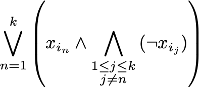

# SAT Sudoku solver

This is a Sudoku solver based on [PicoSAT](http://fmv.jku.at/picosat/), using the python wrapper [pycosat](https://github.com/ContinuumIO/pycosat.git).
See more about SAT [here](https://en.wikipedia.org/wiki/Boolean_satisfiability_problem).

Four constraints are applied:

- Each cell is filled with one and only one digit from 1 to 9.
- Each row contains all nine different digits.
- Each column contains all nine different digits.
- Each sub-box contains all nine different digits.

To enforce these constraints, the filling of each cell is modelled as a 9D 0/1 vector, such that it's filled with `i` if the `i`th element is 1.
Clearly, it must satisfy that the sum of all elements is 1.
To enforce the different digit constraints, it must also satisfy that the sum of `j`th element of all vectors in a row/column/sub-box is 1, for all `j` from 1 to 9.
This way, we obtain a number of equality constraints in such form as:


Since each variable is either 0 or 1, we may interprete each equality constraint as a DNF:



Now the problem is that `PicoSAT` solver requires CNF whereas we have only DNF, and it's well known that the exact conversion from DNF to CNF is NP-complete.
Note that here we cannot relax so that only satisfiability is retained to overcome the NP-completeness, because we have to find the solution.
Luckily, we can precompute the CNF of 1-DNF, 2-DNF, ..., 9-DNF, and do proper substitution to retrieve the correct CNF from the constraints.
It takes about a minute to make the conversion.

Finally, we feed the CNF to the SAT solver.
There should be around 900,000 CNF clauses in total.
The time to find solution should be around 5 seconds.
The results are then interpreted and printed as a sudoku board.

## Install

```bash
python3 -m virtualenv rt
. rt/bin/activate
pip install -r requirements.txt
cd pycosat-0.6.3 && python setup.py install
```

# How to use

```bash
python sudoku.py SUDOKU_BOARD_FILE
```

An example of `SUDOKU_BOARD_FILE` is `example-boards/board.txt`.

The output of `example-boards/board.txt` will be:

```
INFO|2019-06-14 17:08:58,713|
2 4 _ _ _ 3 _ 9 _
_ 5 _ 1 2 7 _ 8 _
_ _ _ _ _ _ 5 _ 7
7 _ 2 4 _ _ _ 6 _
_ _ 5 _ _ _ 2 _ _
_ 9 _ _ _ 2 7 _ 3
6 _ 4 _ _ _ _ _ _
_ 8 _ 2 6 1 _ 7 _
_ 7 _ 5 _ _ _ 3 2
INFO|2019-06-14 17:09:25,044|Converted sudoku into CNF; 908978 clauses in total
INFO|2019-06-14 17:09:30,530|Solved
INFO|2019-06-14 17:09:30,530|
2 4 7 8 5 3 1 9 6
9 5 6 1 2 7 3 8 4
8 3 1 9 4 6 5 2 7
7 1 2 4 3 5 9 6 8
3 6 5 7 9 8 2 4 1
4 9 8 6 1 2 7 5 3
6 2 4 3 7 9 8 1 5
5 8 3 2 6 1 4 7 9
1 7 9 5 8 4 6 3 2
```

## Related project

Another SAT-based sudoku solver can be found in [here](https://github.com/ContinuumIO/pycosat/blob/master/examples/sudoku.py), which may differ from the method described in this repository (I didn't read into it).
